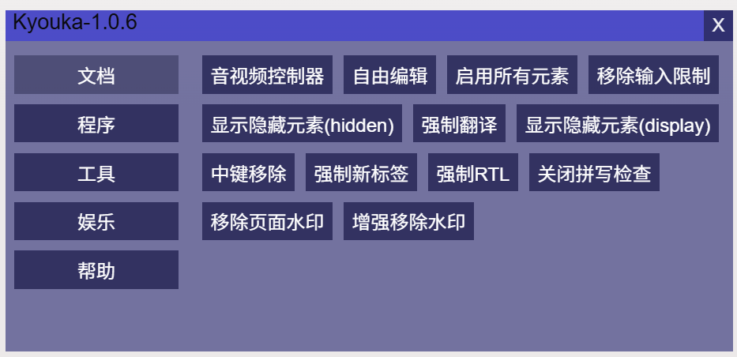

# Kyouka
注入到网页中的工具菜单 以及利用各种冷门API实现的小工具

### 安装
在Release中下载扩展程序的crx文件 打开Chrome扩展页面 将文件拖动到页面中即可安装
### 使用方式
安装后重启浏览器(部分旧标签页不生效) 在网页中(首页可能无效)通过Alt+M或点击扩展列表中的扩展项目打开菜单

如果不慎将菜单拖出了屏幕范围 可通过Alt+Shift+M重置位置
### 功能列表
#### 菜单
- 恢复音视频控制条
- 自由编辑页面
- 启用所有元素
- 移除输入限制
- 显示隐藏元素 
- 强制翻译元素内容
- 鼠标中键移除元素
- 强制在新标签页打开超链接
- 强制RTL(右到左)布局
- 关闭拼写检查
- 注入JS
- 注入CSS
- 屏蔽eval函数
- 屏蔽open函数
- 屏蔽sendBeacon函数
- 屏蔽close函数
- 屏蔽日志输出
- 强制属性可配置
- 打印页面JSON操作(stringify parse)
- 打印页面Base64操作(atob btoa)
- 屏幕像素取色
- 将页面转为文档画中画
- 录制Canvas
- 播放音频
- 修改网页背景
- 修改网页图标
- 复制及修改网页标题
- 伪造页面事件
- 移除页面水印
- 离开页面确认
- 统计页面数据 查看客户端信息
- 屏蔽剪切板写入
- 屏蔽close函数调用
#### 设置页
##### 所有和菜单重复的功能代表开启后会在全局生效
- 移除CSP限制
- 绕过控制台检测
- 屏蔽剪切板写入
- 屏蔽控制台输出
- 拦截未捕获异常监听
- 屏蔽动态执行字符串代码
- 日志打印附带调用栈
### 最后
感谢使用

插件娱乐为主 部分功能不完善