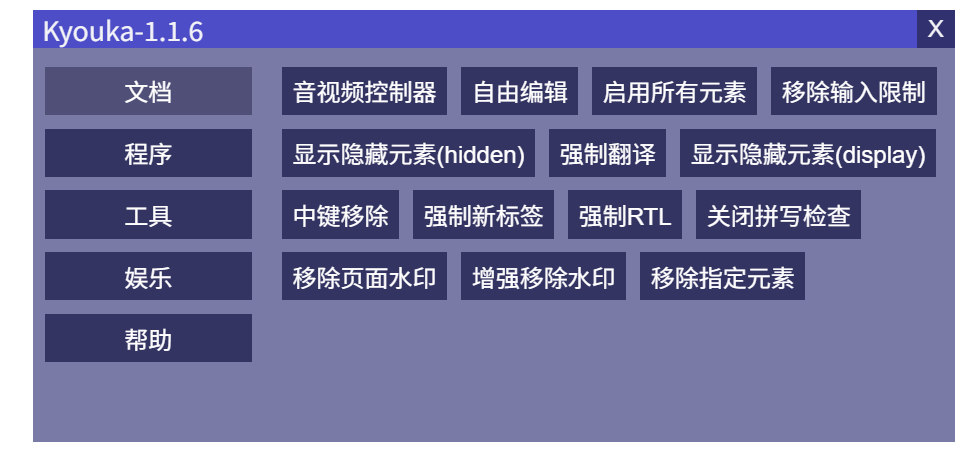
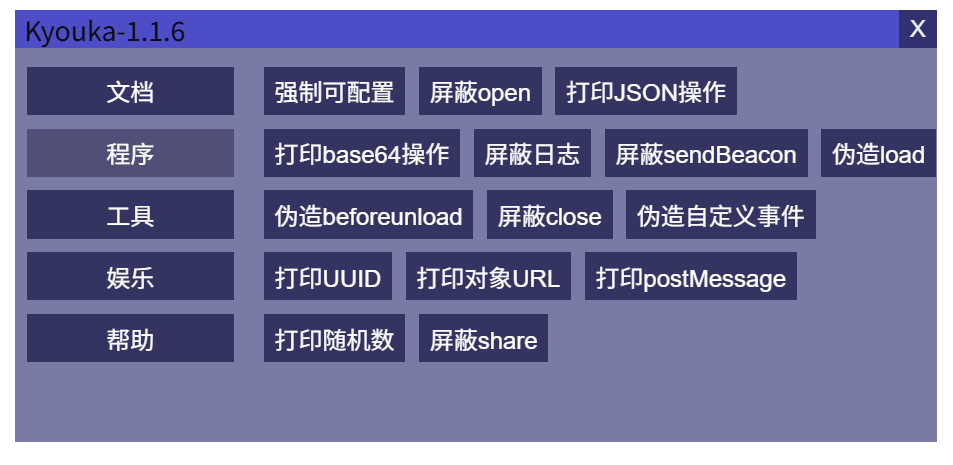
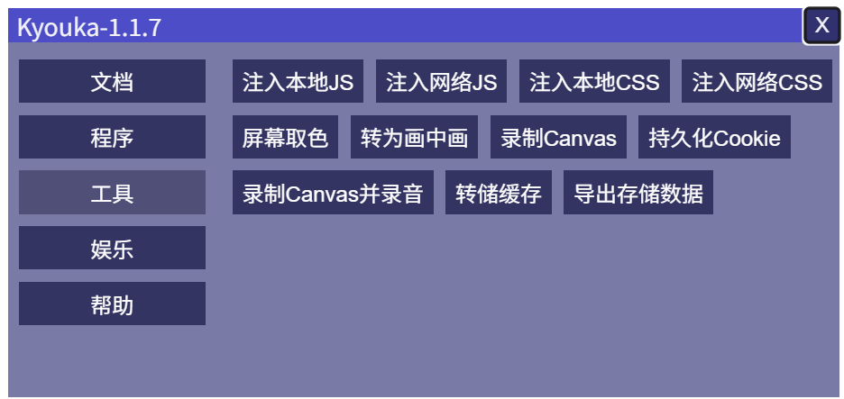
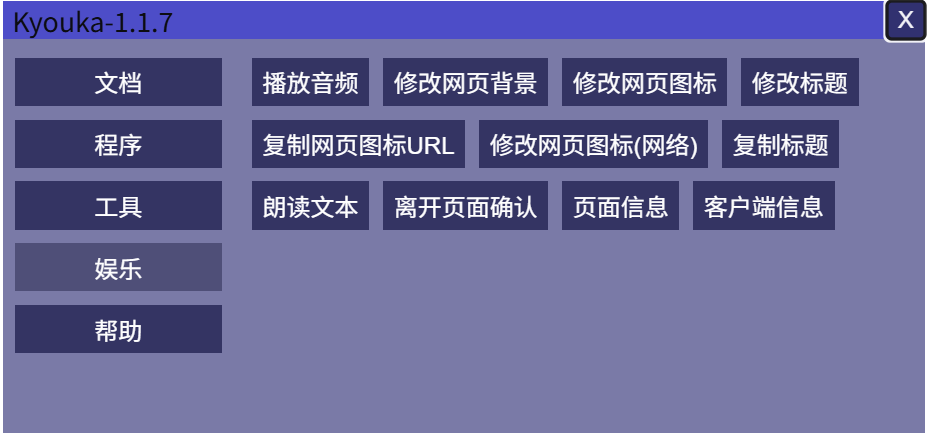
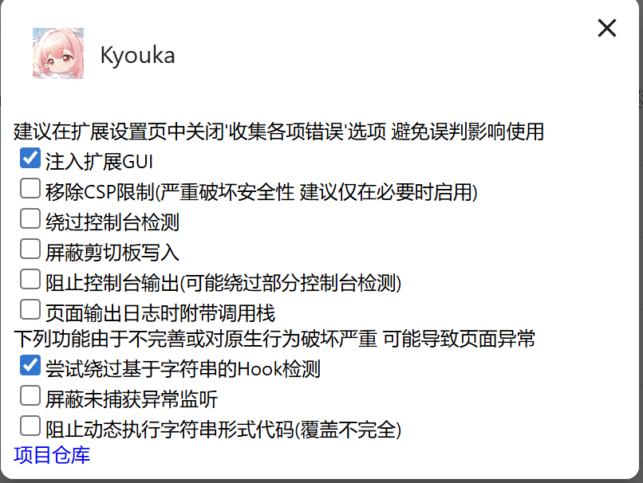

# Kyouka
注入到网页中的工具菜单 以及利用各种冷门API实现的小工具

### 图片展示

### 安装
在Release中下载扩展程序的crx文件 打开Chrome扩展页面 将文件拖动到页面中即可安装
### 使用方式
安装后重启浏览器(部分旧标签页不生效) 在网页中(浏览器首页可能无效)通过Alt+M或点击扩展列表中的扩展项目打开菜单

如果不慎将菜单拖出了屏幕范围 可通过Alt+Shift+M重置位置
### 功能列表
#### 菜单

##### 文档组
- 恢复音视频控制条
- 自由编辑页面
- 启用所有元素
- 移除输入限制
- 显示隐藏元素(分为移除hidden属性和移除display:none两种)
- 强制允许翻译元素内容
- 鼠标中键移除元素
- 强制在新标签页打开超链接
- 强制开关RTL(右到左)布局
- 关闭输入元素拼写检查
- 移除页面水印
- 移除指定名称的HTML元素

##### 程序组
- 强制可配置(使defineProperty类方法调用时writable和configurable参数必定为true)
- 屏蔽open函数
- 打印页面JSON操作(stringify parse rawJSON)
- 打印页面Base64操作(atob btoa)
- 屏蔽日志输出
- 屏蔽sendBeacon函数
- 屏蔽close函数
- 伪造页面事件(包含load unload事件快捷键 亦可自定义事件名)
- 打印crypto.randomUUID返回
- 打印URL.createObjectURL返回
- 打印postMessage参数
- 打印Math.random返回
- 屏蔽share函数
##### 工具组
- 注入JS(选择本地文件或从互联网加载)
- 注入CSS(选择本地文件或从互联网加载)
- 屏幕像素取色
- 将页面转为文档画中画
- 录制Canvas(支持选择录音)
- 转储页面Cache(一个供页面主动缓存数据的API)
- 导出数据为CSV(Cookie LocalStorage SessionStorage条目)
- 持久化Cookie(将页面Cookie全部改为390日后过期)

##### 娱乐组
- 播放本地音频
- 修改网页背景
- 修改网页图标(本地文件或网络)
- 复制及修改网页标题
- 复制网页图标URL
- 朗读输入文本
- 离开页面确认
- 统计页面数据及查看客户端信息
#### 设置页
##### 所有和菜单重复的功能代表开启后会在全局生效
- 移除CSP限制
- 绕过控制台检测
- 屏蔽剪切板写入
- 屏蔽控制台输出
- 日志打印附带调用栈
- 拦截未捕获异常监听
- 屏蔽动态执行字符串代码
### 最后
感谢使用

插件娱乐为主